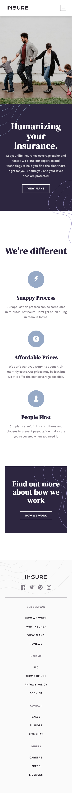
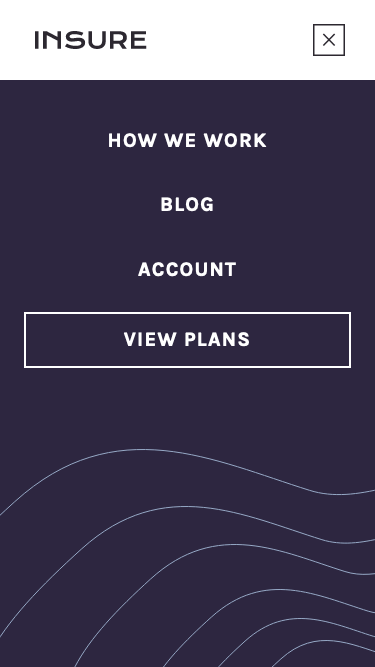
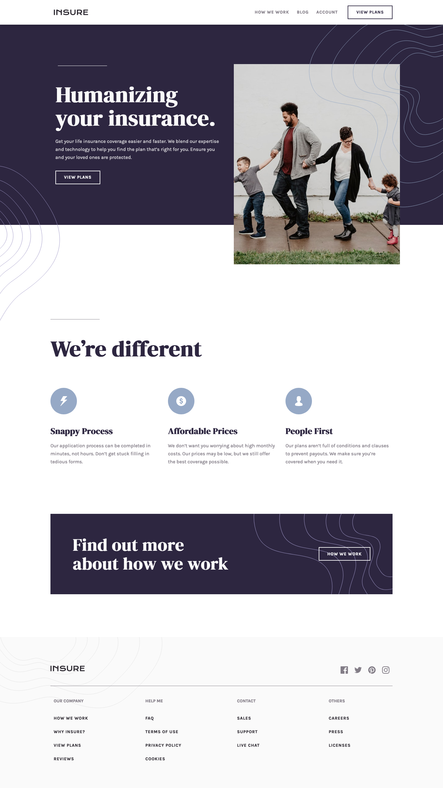

# Frontend Mentor - Insure Landing Page Solution

This is a solution to the [Insure Landing Page challenge on Frontend Mentor](https://www.frontendmentor.io/challenges/insure-landing-page-uTU68JV8). Frontend Mentor challenges help you improve your coding skills by building realistic projects. 

## The challenge

Users should be able to:

- View the optimal layout for the site depending on their device's screen size
- See hover states for all interactive elements on the page

## Screenshots

### Mobile


### Mobile Menu


### Desktop


## Built with

- Semantic HTML5 markup
- CSS custom properties
- Flexbox
- CSS Grid
- Mobile-first workflow
- JS

## What I learned

I picked this challenge because I wanted to practise building an animated mobile menu. I created an 'open' class which gets activated via JavaScript:

```js
function toggleMenu() {
    if (isAnimating) return;

    isAnimating = true;

    HEADER.classList.toggle('open');

    setTimeout(() => isAnimating = false, 750);
}

BUTTON.addEventListener('click', toggleMenu);
```

The 'open' styles get applied to various elements in the header so that the mobile menu falls from the top.

At first, it was possible for the user to click the hamburger button multiple times in quick succession, messing up the animation. The `setTimeout()` function prevents this by ensuring that the menu cannot be toggled while the animation is still running. Instead the user has to wait for the animation to finish before they can toggle the menu again.

Another issue I noticed was that the user is able to scroll vertically while the menu is open. However I decided not to do anything about this since most desktop users would not see the mobile menu because the viewport is to wide.

Other than the mobile menu, the most difficult part of this challenge was situating the background image patterns correctly. I achieved this either by using the `background-image` property or by positioning psuedo-elements in relation to the parent:

```css
.cta::before {
    content: url('images/bg-pattern-intro-left-mobile.svg');
    position: absolute;
    z-index: -1;
    top: 0; left: 0;
}

.cta::after {
    content: url('images/bg-pattern-intro-right-mobile.svg');
    position: absolute;
    right: 0; bottom: -11.5rem;
}
```

## Continued development

This was my most successful attempt at a mobile menu so far but I want to keep practising as it is a common feature of websites. I want to try using Bootstrap again. I had problems setting up Bootstrap so I want to try and figure them out.

## Useful resources

- [Add Media Queries with JavaScript](https://css-tricks.com/working-with-javascript-media-queries/) - I borrowed the code from this article to add a media query in JavaScript which closes the mobile menu if the user resizes the viewport to a certain width.

